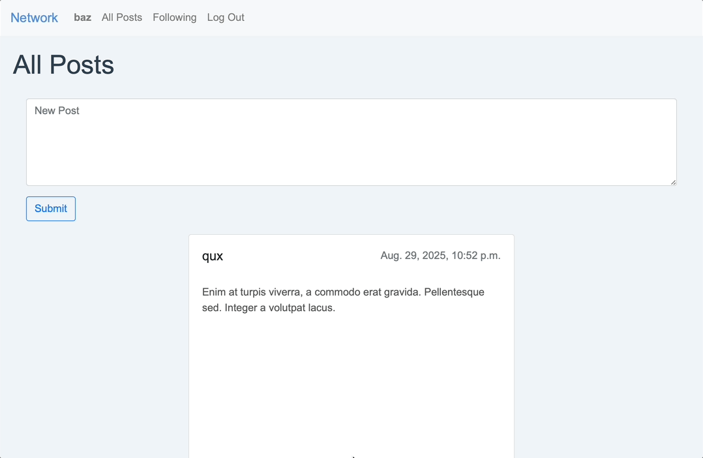

# Network

[](https://www.python.org/)
[](https://www.djangoproject.com/)
[](https://getbootstrap.com/)
[](LICENSE)

**Social Network**

A Twitter-like social network website built using Django and Django REST Framework.

## Demo

### Application Walkthrough



### Video Overview

[](https://youtu.be/2tNgXRcism4)

## Features

- **User Authentication**: Secure login and registration system.
- **Post Creation**: Users can create, edit, and delete text-based posts.
- **Post Interaction**: Like and unlike posts.
- **User Profiles**: View and edit user profiles.
- **Following System**: Follow and unfollow other users to see their posts.
- **Pagination**: Efficient navigation through posts.

## Technologies Used

- **Backend**: Django, Django REST Framework
- **Frontend**: HTML, CSS, JavaScript
- **Database**: SQLite
- **Deployment**: Gunicorn, Whitenoise

## Setup Instructions

1. Clone the repository:

   ```bash
   git clone https://github.com/AmirMahdi-Tizchang/cs50w-network.git
   cd cs50w-network
   ```

2. Create and activate a virtual environment:

   ```bash
   python -m venv venv
   source venv/bin/activate  # On Windows: venv\Scripts\activate
   ```

3. Install dependencies:

   ```bash
   pip install -r requirements.txt
   ```

4. Apply database migrations:

   ```bash
   python manage.py migrate
   ```

5. Create a superuser (optional, for admin access):

   ```bash
   python manage.py createsuperuser
   ```

6. Run the development server:

   ```bash
   python manage.py runserver
   ```

7. Access the app at: `http://127.0.0.1:8000/`

## License

This project is licensed under the MIT License - see the [LICENSE](LICENSE) file for details.

## Contact

AmirMahdi Tizchang – [GitHub](https://github.com/AmirMahdi-Tizchang)
